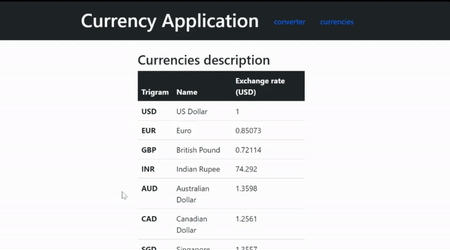

# Currency Converter

  
  
Currency Converter is a project that allows you to get infos on currencies and do conversion.  
The frontend is made with Angular 12 and the backend is made with Java and Spring boot.  

## Building and Running

### Requirements for building
To build the project you need to install :  
- [java 8](https://www.oracle.com/fr/java/technologies/javase/javase-jdk8-downloads.html)  
- [nodejs](https://nodejs.org/en/download/)  
- [angular cli](https://angular.io/guide/setup-local#install-the-angular-cli) 

 ### Building and Running

```bash
git clone https://github.com/LearningCitizen/CurrencyConverter
cd currency-converter
mvn clean install
java -jar target/currency-converter-0.0.2-SNAPSHOT.jar
```
The application interface runs on http://localhost:8080/

## APIs

### Currency Converter Backend
- getAllCurrencies : http://localhost:8080/api/v1/currencies
- getCurrencyByTrigram : http://localhost:8080/api/v1/currencies/currency
- convertCurrency : http://localhost:8080/api/v1/currencies/conversion

### Swagger
- swagger ui : http://localhost:8080/swagger-ui/index.html
- swagger api-docs : http://localhost:8080/v2/api-docs

## Contributing
Pull requests are welcome. For major changes, please open an issue first to discuss what you would like to change.

Please make sure to update tests as appropriate.

## License
[MIT](https://choosealicense.com/licenses/mit/)